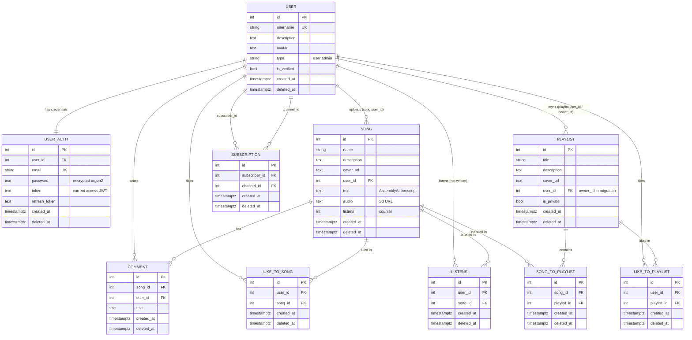

# PROJECT_OVERVIEW — музична платформа (бакалаврський моноліт)

> Технічний огляд поточного стану репозиторію `diploma/` для обговорення подальшої розробки
> (магістерська тема: «Побудова мікросервісної архітектури музичної платформи з використанням
> поведінкової аналітики та ШІ»). Документ описує **лише те, що є в коді**; розбіжності та баги
> позначені явно. Стан на 2026-09-26.

---

## 0. TL;DR

- **Два застосунки** в одній папці, без спільного кореня: `server/` (NestJS 11 + Sequelize 6 + PostgreSQL) і `client/` (React 19 + Vite 6 + MUI 7).
- Репозиторій **не є git-репозиторієм**, немає Docker, CI, тестів, `.env.example`.
- Бекенд — **модульний моноліт у стилі гексагональної архітектури** (ports & adapters) + CQRS-шина `@nestjs/cqrs` для міжмодульних викликів (query/command handlers). Доменні події (EventBus) **не використовуються**.
- Файли (аудіо, обкладинки, аватари) — **AWS S3, публічні URL**; стрімінг — браузерний `<audio src="https://bucket.s3...">` напряму з S3 (бекенд аудіо не проксує).
- ШІ-транскрипція — **AssemblyAI** (`speech_model: 'slam-1'`), викликається **синхронно всередині HTTP-запиту створення пісні**; результат — поле `song.text`.
- Поведінкові дані сьогодні: лайки (toggle, при unlike **фізичне видалення**), лічильник `song.listens` (інкремент на `ended`, **без user_id**), таблиця `listens` **існує, але ніколи не заповнюється**. Жодних подій play/pause/seek/skip на бекенд не надходить.
- Кілька суттєвих багів/розбіжностей (див. §15), зокрема: плутанина `user_auth.id` vs `user.id`, розбіжність схем міграцій і моделей (`playlist.owner_id` vs `user_id`), SQL-ін'єкція в пошуку.

---

## 1. Стек і версії

### Загальне
| Що | Значення |
|---|---|
| Мова | TypeScript (сервер: TS 5.8, `strictNullChecks: false`, `noImplicitAny: false`; клієнт: TS ~5.7, `strict: true`) |
| Node.js | версія не зафіксована (`.nvmrc`/`engines` відсутні); локально стоїть v24 |
| Пакетний менеджер | npm (`package-lock.json` в обох частинах) |
| БД | PostgreSQL (драйвер `pg` 8.15), підключення з **обов'язковим SSL** (`ssl.require: true, rejectUnauthorized: false`) → по суті розрахована на керовану хмарну БД |
| Файлове сховище | AWS S3 (`@aws-sdk/client-s3` 3.802) |
| ШІ | AssemblyAI SDK (`assemblyai` 4.12.2) |

### Бекенд (`server/package.json`) — встановлені версії
| Пакет | Версія | Використовується? |
|---|---|---|
| `@nestjs/core`, `@nestjs/common`, `@nestjs/platform-express` | 11.1.x | так (Express під капотом) |
| `@nestjs/config` | 4.0.2 | так |
| `@nestjs/cqrs` | 11.0.3 | так (QueryBus/CommandBus) |
| `@nestjs/jwt` | 11.0.0 | так |
| `@nestjs/sequelize` | 11.0.0 | так |
| `sequelize` / `sequelize-typescript` | 6.37.7 / 2.1.6 | так (ORM) |
| `sequelize-cli` | 6.6.2 | так (міграції) |
| `@nestjs/swagger` | 11.1.6 | так (`/docs`) |
| `express-basic-auth` | 1.2.1 | так (захист `/docs`) |
| `class-validator` / `class-transformer` | 0.14.1 / 0.5.1 | так (валідація DTO) |
| `argon2` | 0.43 | так (хешування паролів) |
| `tweetnacl` | 1.0.3 | так (SHA-512 + симетричне шифрування хешу пароля) |
| `@aws-sdk/client-s3` | 3.802 | так |
| `assemblyai` | 4.12.2 | так |
| `dotenv` | 16.5 (dev) | так (читання `env/.env`) |
| `@nestjs/passport`, `passport`, `passport-jwt` | — | **ні** (встановлені, не використовуються) |
| `@nestjs/schedule` | 6.0 | **ні** |
| `bcrypt`, `joi`, `uuid` | — | **ні** |
| `jest`, `ts-jest`, `supertest`, `@nestjs/testing` | — | налаштовані, але **тестів немає** |

### Фронтенд (`client/package.json`) — встановлені версії
| Пакет | Версія | Використовується? |
|---|---|---|
| `react` / `react-dom` | 19.1.0 | так |
| `vite` + `@vitejs/plugin-react` | 6.3.4 | так (dev-сервер на порту **5000**) |
| `react-router-dom` | 7.5.3 | так (`BrowserRouter`) |
| `@mui/material`, `@mui/icons-material`, `@emotion/*` | 7.1.0 | так (весь UI) |
| `axios` | 1.9.0 | так (HTTP) |
| `@reduxjs/toolkit`, `react-redux` | 2.7.0 / 9.2 | **фактично ні** — store створено без редюсерів і не підключено `<Provider>`; `authSlice` не використовується |
| `@tanstack/react-query` | 5.75.1 | **ні** |
| `tamagui` та `@tamagui/*` | 1.126.4 | **ні** (є тільки `tamagui.config.ts`, ніде не імпортується) |

---

## 2. Структура репозиторію

```
diploma/
├── client/                         # SPA на React + Vite
│   ├── index.html                  # точка входу Vite (title "Vite + React + TS")
│   ├── vite.config.ts              # порт 5000, host: true
│   ├── public/
│   └── src/
│       ├── main.tsx                # ReactDOM.createRoot → <App/>
│       ├── App.tsx                 # тема MUI, роутер, PrivateRoute, PlayerProvider, BottomPlayer
│       ├── api/                    # тонкі axios-обгортки: auth.ts, song.ts, playlist.ts, user.ts, client.ts
│       ├── pages/                  # 10 сторінок (Feed, Login, Register, Profile, SongDetail, ...)
│       ├── components/             # Header, SongCard, PlaylistCard, AddToPlaylistDialog, BackButton
│       ├── player/                 # PlayerContext.tsx (стан плеєра), BottomPlayer.tsx (<audio>)
│       ├── store/ , features/auth/ # Redux-заготовка, НЕ підключена
│       ├── tamagui.config.ts       # не використовується
│       └── index.html              # дубль, не використовується Vite
│
└── server/                         # NestJS API
    ├── env/.env                    # реальні змінні оточення (є в .gitignore за шаблоном .env)
    ├── nest-cli.json, tsconfig*.json, eslint.config.mjs, .prettierrc
    ├── dist/                       # зібраний код (артефакт)
    └── src/
        ├── main.ts                 # bootstrap
        ├── app.initializer.ts      # CORS, глобальні interceptor/filter/pipe, Swagger
        ├── app.module.ts           # кореневий модуль + LogRequestMiddleware
        ├── sequelize-cli/
        │   ├── config/config.js    # конфіг sequelize-cli (читає ../../../env/.env)
        │   └── migrations/         # 10 міграцій (20250410132521…530)
        └── core/
            ├── configuration/      # config.ts (env → typed config), config.type.ts
            ├── shared-kernel/      # спільне ядро
            │   ├── ports/          # інтерфейси: S3, Crypto, Token, Assembly
            │   ├── secondary-adapters/  # реалізації: s3/, crypto/, token/, assembly/, postgres/
            │   ├── rest/           # ApiResponse DTO, interceptor, exception filter, log middleware
            │   ├── pipe/           # SwitchableValidationPipe, TransformFilePipe
            │   ├── pagination/     # інфраструктура пагінації (НЕ використовується)
            │   ├── decorators/     # @Search (НЕ використовується)
            │   ├── data/           # константи (mockData, пагінація), enum-и (багато — залишки іншого проєкту)
            │   ├── common/         # formatSongText, formatValidationError (друге не використовується)
            │   └── interfaces/     # UseCase<I,O>
            └── components/         # бізнес-модулі (bounded contexts)
                ├── auth/           # register/login/logout, AuthGuard, @UserAuth()
                ├── user/           # профіль, лайкнуті пісні/плейлисти, query/command handlers для auth
                ├── song/           # пісні, плейлисти, song_to_playlist, listens
                ├── like/           # лайки пісень і плейлистів (toggle)
                └── comment/        # тільки модель і репозиторій, БЕЗ API
```

Кожен компонент має однакову внутрішню структуру:
```
components/<name>/
├── <name>.module.ts
├── primary-adapters/        # REST-контролери
├── application/
│   ├── usecase/             # сценарії (викликаються контролерами)
│   ├── query-handler/       # CQRS-запити, доступні іншим модулям через QueryBus
│   ├── command-handler/     # CQRS-команди, доступні іншим модулям через CommandBus
│   ├── data/                # DTO, request/response класи
│   ├── guards/, decorators/ # (тільки в auth)
├── ports/                   # інтерфейси репозиторіїв + Symbol-токени DI
└── secondary-adapters/postgres/
    ├── data/*.model.ts      # Sequelize-моделі
    ├── repository/          # реалізації репозиторіїв
    └── query-params/        # типи where/create/update
```

---

## 3. Архітектура бекенду

### Точка входу
`server/src/main.ts`:
1. `NestFactory.create<NestExpressApplication>(AppModule, { rawBody: true })`
2. `initApi(app)` — `enableCors()` (усі origin), глобальний `ApiResponseInterceptor`, глобальний `FinalExceptionFilter`, глобальний `SwitchableValidationPipe({ whitelist: true, transform: true })`.
3. `initDocs(app)` — Swagger UI на `/docs` з Bearer-auth; basic-auth на `/docs`, якщо задано `swagger.username`.
4. `app.listen(config.node.port)`.

Глобального префікса (`/api`) і версіонування **немає** — ендпоінти висять у корені (`/login`, `/song`, ...).

### Модулі (`AppModule.imports`)
`ConfigModule (global)`, `PostgresConnectionModule`, `CryptoModule (global)`, `S3Module`, `UserModule`, `AuthModule`, `CommentModule`, `LikeModule`, `SongModule`. `TokenModule` (global) імпортується з `AuthModule`, `AssemblyModule` (global) — з `SongModule`.

### Шари і патерни
- **Primary adapters** — контролери Nest. Роблять лише маппінг HTTP → use case.
- **Use cases** — класи `implements UseCase<I, O>` з методом `execute()`. Уся бізнес-логіка тут.
- **Ports** — інтерфейси репозиторіїв/сервісів, інжектяться через `Symbol.for('...')` токени (`@Inject(SongRepositoryType)`).
- **Secondary adapters** — Sequelize-репозиторії (повертають plain-об'єкти через `.toJSON()`), S3, AssemblyAI, JWT, Crypto.
- **Міжмодульна взаємодія** — через `QueryBus`/`CommandBus` (`@nestjs/cqrs`). Приклади:
  - `AuthGuard` → `GetUserAuthByTokenQuery` (модуль user)
  - use cases пісень/плейлистів → `CheckSongLikeQuery`, `CheckPlaylistLikeQuery` (модуль like)
  - `DeleteSongUseCase` → `DeleteSongLikesCommand` (модуль like)
  - `CreateSongLikeUseCase` → `GetSongByIdQuery` (модуль song)
  
  **Важливо для мікросервісів:** шина вже є, але вона синхронна, in-process і використовується лише для query/command. `EventBus`/`@EventsHandler` ніде не використовуються — доменних подій на кшталт `SongLiked`, `SongPlayed` немає.
- **Транзакції** — вручну через `sequelize.transaction()` у use case'ах (register, login, delete song/playlist) з передачею `Transaction` у команди/репозиторії.
- **Soft delete** — у всіх таблицях є `deleted_at`; `song`, `playlist`, `user` видаляються м'яко (`smartDelete`), а `like_to_*`, `song_to_playlist`, `listens` — **фізично** (`destroy`).

### Middleware
- `LogRequestMiddleware` на `*` — пише в stdout через `Logger('HTTP')`: `ip, дата, метод, URL, статус, content-length, час відповіді (мс)`. Не зберігається нікуди, user id не логується.

### Формат відповіді
`ApiResponseInterceptor` загортає будь-який результат контролера:
```json
{ "data": <результат>, "error": null }
```
(якщо результат — `Paginated`, додається `pagination`, але пагінація ніде не використовується).

### Обробка помилок
`FinalExceptionFilter` (`@Catch()` усього):
- `HttpException` → статус з винятку, тіло `{ "data": null, "error": <серіалізований HttpException: {response, status, message, name, options}> }`.
- Будь-яка інша помилка → `InternalServerErrorException(message)` → 500; у `NODE_ENV === 'prod'` для 5xx повертається `error: "Something went wrong"`. 5xx логуються зі стеком.
- Багато use case'ів кидають **звичайний `Error`** («Playlist not found», «Song already in playlist», «Error creating song») → клієнт отримує **500** замість 400/404.
- Фронтенд (`handleApiError`) читає `error.response.data.message`, а сервер кладе повідомлення в `error.response.data.error.message` — тобто тексти помилок на фронт фактично не доходять.

### Валідація
- `SwitchableValidationPipe` — наслідник `ValidationPipe` з можливістю вимкнути валідацію декоратором `@DisableAutoValidation()` на класі (ніде не застосовано). Опції: `whitelist: true` (зайві поля відкидаються), `transform: true`.
- DTO валідуються `class-validator` (`@IsEmail`, `@IsStrongPassword({minLength: 6, ...0})`, `@IsNumber`, `@IsBoolean` + `@Transform` для multipart-булевих).
- Файли: `TransformFilePipe({ isRequired })` — перевіряє лише наявність файлу. **Немає** перевірок MIME-типу, розміру, тривалості аудіо. Multer працює в режимі memory storage (файл повністю в RAM, `file.buffer`), ліміт розміру не заданий.
- Параметри шляху — `ParseIntPipe`.

### Конфігурація
- `core/configuration/config.ts` — викликає `dotenv.config({ path: 'env/.env' })` (шлях відносно cwd, тобто сервер треба запускати з `server/`) і будує типізований об'єкт:
  - `node: { port, nodeEnv, encryptionKey, jwtSecretKey }`
  - `swagger: { username: DOCS_USER, password: DOCS_PASSWORD }`
  - `db: { dialect: 'postgres', ..., logging: false, define: { timestamps: false }, dialectOptions.ssl }`
  - `aws: { filesBucketName, accessKeyId, secretAccessKey, defaultRegion }`
  - `assembly: { apiKey }`
- Завантажується в `ConfigModule.forRoot({ isGlobal: true, load: [config] })`, використовується через `configService.get('aws.filesBucketName')` тощо.
- `PostgresConnectionModule` — `SequelizeModule.forRootAsync`, моделі підхоплюються glob'ом `components/**/secondary-adapters/postgres/data/*.model{.ts,.js}`, стоїть `synchronize: true`, але **без `autoLoadModels: true`** — тож у `@nestjs/sequelize` авто-синхронізація схеми, найімовірніше, не спрацьовує; схема має створюватися міграціями (див. розбіжності в §4).

---

## 4. Модель даних

PostgreSQL, 10 таблиць з міграцій (`server/src/sequelize-cli/migrations/`). Усі PK — `INTEGER autoIncrement`. `timestamps: false` глобально — `created_at` задається дефолтом `now()`, `updated_at` **немає ніде**.

### Таблиці

**`user`**
| Поле | Тип | Обмеження |
|---|---|---|
| id | INTEGER | PK |
| username | VARCHAR(255) | NOT NULL, **UNIQUE** |
| description | TEXT | NULL |
| avatar | TEXT | NULL (URL у S3 або mock-аватар) |
| type | VARCHAR(255) | NOT NULL (у моделі — ENUM `user`/`admin`, дефолт `user`) |
| is_verified | BOOLEAN | NOT NULL, default false |
| created_at | TIMESTAMPTZ | NOT NULL, default now() |
| deleted_at | TIMESTAMPTZ | NULL |

Міграція також створює Postgres-тип `user_type AS ENUM('user','admin')`, але колонка `type` оголошена як STRING — тип не використовується.

**`user_auth`** (облікові дані, 1:1 з user)
| Поле | Тип | Обмеження |
|---|---|---|
| id | INTEGER | PK |
| user_id | INTEGER | NOT NULL, FK → user.id |
| email | VARCHAR | NOT NULL, **UNIQUE** (зберігається в lowercase) |
| password | TEXT | NOT NULL (зашифрований argon2-хеш, див. §6) |
| token | TEXT | NULL — поточний access JWT |
| refresh_token | TEXT | NULL — поточний refresh JWT |
| created_at, deleted_at | TIMESTAMPTZ | |

**`song`**
| Поле | Тип | Обмеження |
|---|---|---|
| id | INTEGER | PK |
| name | VARCHAR | NOT NULL |
| description | TEXT | **NOT NULL** у міграції (але код завжди пише `null` — див. розбіжності) |
| cover_url | TEXT | NULL |
| user_id | INTEGER | NOT NULL, FK → user.id (автор) |
| text | TEXT | NULL — транскрипція від AssemblyAI |
| audio | TEXT | NOT NULL — публічний URL у S3 |
| listens | INTEGER | NOT NULL, default 0 — денормалізований лічильник |
| created_at, deleted_at | TIMESTAMPTZ | |

**`comment`** — `id, song_id (FK song), user_id (FK user), text TEXT NOT NULL, created_at, deleted_at`. API немає.

**`playlist`**
| Поле | Тип | Обмеження |
|---|---|---|
| id | INTEGER | PK |
| title | VARCHAR | NOT NULL |
| description | TEXT | NULL |
| cover_url | TEXT | NULL |
| **owner_id** (міграція) / **user_id** (модель і весь код) | INTEGER | NOT NULL, FK → user.id |
| is_private | BOOLEAN | NOT NULL, default false |
| created_at, deleted_at | TIMESTAMPTZ | |

**`song_to_playlist`** (M:N) — `id, song_id (FK song), playlist_id (FK playlist), created_at, deleted_at`. Позиції/порядку треків **немає**.

**`like_to_song`** (M:N user↔song) — `id, user_id (FK user), song_id (FK song), created_at, deleted_at`.

**`like_to_playlist`** (M:N user↔playlist) — `id, user_id (FK user), playlist_id (FK playlist), created_at, deleted_at`.

**`subscription`** (підписки user→user) — `id, subscriber_id (FK user), channel_id (FK user), created_at, deleted_at`. **Моделі і коду немає** — лише таблиця.

**`listens`** (журнал прослуховувань) — `id, user_id (FK user), song_id (FK song), created_at, deleted_at`. Модель і репозиторій є, але **жоден код не створює записів** (тільки видаляє при видаленні пісні).

### Індекси
Явних індексів **немає**. Є лише ті, що Postgres створює автоматично: PK у кожній таблиці, UNIQUE на `user.username` і `user_auth.email`. FK-колонки (`song.user_id`, `like_to_song.user_id/song_id`, ...) **не проіндексовані**. Унікальності пари `(user_id, song_id)` у лайках немає — захист від дублю лише на рівні коду (перевірка перед вставкою, без транзакції).

### Зв'язки в Sequelize-моделях
- `User` hasMany `Song` (`songs`), hasMany `Playlist` (`playlists`), belongsToMany `Song` through `LikeToSong` (`liked_songs`), belongsToMany `Playlist` through `LikeToPlaylist` (`liked_playlists`).
- `Song` belongsTo `User` (`user`), hasMany `Comment`, hasMany `Listens` (`listens_records`), hasMany `LikeToSong` (`likes`).
- `Playlist` belongsTo `User` (`user`), belongsToMany `Song` through `SongToPlaylist` (`songs`), hasMany `LikeToPlaylist` (`likes`).
- `Comment`, `Listens`, `LikeTo*`, `SongToPlaylist` — belongsTo відповідних сутностей.

### ⚠️ Розбіжності міграцій і коду (перевірити на живій БД через `\d table`)
1. `playlist.owner_id` у міграції vs `user_id` у моделі/коді. Якщо схема з міграцій — створення/читання плейлистів мало б падати. Отже, реальна БД, імовірно, змінювалася вручну або створювалась інакше.
2. `song.description NOT NULL` у міграції, а `CreateSongUseCase` завжди пише `description: null`.
3. `user.type` — STRING у БД, ENUM у моделі; тип `user_type` створений, але не прив'язаний.

### ER-діаграма



---

## 5. API

Базовий URL локально: `http://localhost:<PORT>` (фронт хардкодить `http://localhost:3000`). Усі відповіді загорнуті в `{ data, error }` (§3). «Auth» = заголовок `Authorization: Bearer <access JWT>` + `AuthGuard`. Пагінації немає ніде — списки повертаються повністю.

`is_liked` у відповідях обчислюється окремим запитом `CheckSongLikeQuery`/`CheckPlaylistLikeQuery` **на кожен елемент** (N+1).

### Auth (`AuthController`, без префікса)
| Метод | Шлях | Auth | Приймає | Повертає | Сутності |
|---|---|---|---|---|---|
| POST | `/register` | ні | `multipart/form-data`: `username`*, `email`*, `password`* (≥6 символів), `description?`, файл `avatar?` | `RegisterResponse`: `id, username, description, avatar, type, is_verified, email, token, refresh_token, created_at, deleted_at` | INSERT `user`, `user_auth`; UPDATE `user_auth.token/refresh_token`; S3 `avatar/` |
| POST | `/login` | ні | JSON `{ email, password }` | `LoginResponse` (ті самі поля) | SELECT `user_auth`, `user`; UPDATE `user_auth.token/refresh_token` |
| POST | `/logout` | так | — | `{ status: true }` | UPDATE `user_auth` → token/refresh_token = null |

### User (`/user`, весь контролер під AuthGuard)
| Метод | Шлях | Приймає | Повертає | Сутності |
|---|---|---|---|---|
| GET | `/user/liked-songs` | — | `{ liked_songs: Song[] }` (кожна з `is_liked`, `user{id,username,avatar}`) | `user` ⋈ `like_to_song` ⋈ `song` ⋈ `user` |
| GET | `/user/liked-playlists` | — | `{ liked_playlists: Playlist[] }` | `user` ⋈ `like_to_playlist` ⋈ `playlist` |
| GET | `/user/:id` | `id` int | профіль: `id, username, description, avatar, type, is_verified, created_at, songs[]` (пісні з `is_liked` для поточного юзера). Плейлисти **не** повертає | `user` ⋈ `song` |

### Song (`/song`, під AuthGuard)
| Метод | Шлях | Приймає | Повертає | Сутності |
|---|---|---|---|---|
| POST | `/song` | `multipart/form-data`: `name`*, файл `audio`* (без перевірки — відсутність → 500), файл `cover?`; поле `text` у DTO є, але ігнорується | `CreateSongResponse`: `id, name, description, cover_url, user_id, audio, text, listens, created_at, deleted_at` | S3 `song/`, `cover/`; **AssemblyAI (синхронно)**; INSERT `song` |
| GET | `/song?search=` | `search?` | `{ songs: Song[] }` — **усі** не видалені пісні; `search` лише піднімає збіги за `name ILIKE` нагору (не фільтрує), далі за `created_at DESC` | `song` ⋈ `user`, `like_to_song` |
| GET | `/song/:id` | `id` | Song + `is_liked` + `user{id,username,avatar}` | `song`, `user`, `like_to_song` |
| POST | `/song/:id/listen` | `id` | `{ status: true }` | UPDATE `song.listens = listens + 1` (read-modify-write, не атомарно). **Хто слухав — не фіксується** |
| DELETE | `/song/:id` | `id` (тільки автор, інакше 403) | `{ status: true }` | hard DELETE `song_to_playlist`, `listens`, `like_to_song`; soft-delete `song`. Файли в S3 **не видаляються** |

### Playlist (`/playlist`, під AuthGuard)
| Метод | Шлях | Приймає | Повертає | Сутності |
|---|---|---|---|---|
| GET | `/playlist` | — | `{ playlists: [...] }` — усі публічні (`is_private=false`), з `is_liked`, `songs_count`, `user` | `playlist` ⋈ `user` ⋈ `songs` |
| POST | `/playlist` | `multipart/form-data`: `title`*, `description?`, `is_private?` ('true'/'1'/'false'/'0'), файл `cover`* (обов'язковий через `TransformFilePipe`) | `CreatePlaylistResponse`: `id, title, description, cover_url, user_id, songs_count: 0, is_private, created_at, deleted_at` | S3 `cover/`; INSERT `playlist` |
| GET | `/playlist/user/:id` | `id` користувача | `{ playlists: [...] }` — лише публічні плейлисти цього юзера | `playlist` |
| GET | `/playlist/:id` | `id` | плейлист + `songs[]` (з `is_liked`) + `user` + `is_liked`; приватний видно лише власнику (інакше — `Error` → 500) | `playlist`, `song_to_playlist`, `song`, `user`, лайки |
| POST | `/playlist/:id/song` | JSON `{ songId: number }` (тільки власник) | `{ status: true }` | INSERT `song_to_playlist` |
| DELETE | `/playlist/:id` | `id` (тільки власник) | `{ status: true }` | hard DELETE `like_to_playlist`, `song_to_playlist`; soft-delete `playlist` |

Видалення пісні з плейлиста, редагування плейлиста/пісні/профілю — **ендпоінтів немає**.

### Likes
| Метод | Шлях | Auth | Приймає | Повертає | Сутності |
|---|---|---|---|---|---|
| POST | `/song-like` | так | JSON `{ songId: number }` | `{ status: true }` | **toggle**: якщо лайк є — DELETE, якщо нема — INSERT `like_to_song` |
| POST | `/playlist-like` | так | JSON `{ playlistId: number }` | `{ status: true }` | toggle `like_to_playlist` |

### Службове
| Метод | Шлях | Опис |
|---|---|---|
| GET | `/docs` | Swagger UI. Basic-auth вмикається, якщо задано `DOCS_USER` — але в `.env` змінні названі `API_DOCS_USER`/`API_DOCS_PASSWORD`, тож **документація фактично відкрита**. |

Health-check ендпоінта немає (`AppController` порожній).

---

## 6. Автентифікація і користувачі

- **Механізм:** JWT (HS256, `@nestjs/jwt`, секрет `JWT_SECRET_KEY`), але **stateful**: поточний access-токен зберігається в `user_auth.token`. Passport не використовується.
- **Реєстрація** (`RegisterUseCase`):
  1. email → lowercase; паралельна перевірка унікальності email і username (400 при збігу).
  2. Пароль: `sha512 (tweetnacl) → argon2.hash → шифрування nacl.secretbox ключем ENCRYPTION_KEY` → зберігається рядок `hex:nonce`.
  3. У транзакції: завантаження аватара в S3 (або mock-URL), INSERT `user` (type=`user`, is_verified=false) + `user_auth`, генерація access (3 год) і refresh (720 год = 30 днів) токенів, збереження обох в `user_auth`.
  4. Повертає профіль + токени.
- **Логін** (`LoginUseCase`): пошук `user_auth` по email (404 якщо нема) → розшифрування + `argon2.verify` (з заглушкою проти timing-атаки) → нові токени → UPDATE `user_auth`. Payload JWT: `{ id, username, email, description, avatar }`.
- **Перевірка запиту** (`AuthGuard`): бере `Authorization`, `jwt.verify` (підпис + строк), потім **шукає рядок `user_auth` з точно таким `token`** → кладе його в `req.userAuth`. Наслідки:
  - одночасно активна **лише одна сесія** на користувача (новий логін інвалідовує старий токен);
  - logout реально відкликає токен;
  - кожен запит = +1 SELECT у БД;
  - без заголовка `Authorization` guard падає з TypeError → **500**, а не 401.
- **Refresh-токен** генерується і зберігається, але **ендпоінта оновлення немає** — через 3 години користувача фактично викидає (фронт про це не знає, токен просто стає невалідним).
- **`@UserAuth()`** повертає рядок `user_auth`, тобто `userAuth.id` — це **id запису user_auth**, а `userAuth.user_id` — id користувача. Код змішує їх (див. §15, баг №1).
- **Ролі:** поле `user.type` (`user`/`admin`) і `is_verified` існують, але **жодних перевірок ролей немає** — адмін-функціоналу не реалізовано.
- **Фронтенд:** токен, refresh-токен, `user_id`, `username`, `avatar`, `description` зберігаються в `localStorage`; `PrivateRoute` пускає, якщо в `localStorage` є `token` (без перевірки строку).

---

## 7. Робота з аудіо

- **Завантаження:** `POST /song`, `FileFieldsInterceptor([{audio,1},{cover,1}])`, Multer memory storage (файл цілком в RAM). Валідації формату/розміру/тривалості немає.
- **Сховище:** AWS S3, бакет `BUCKET_NAME`, регіон `AWS_REGION`. `S3Service.uploadFile` робить `PutObjectCommand` з `ACL: 'public-read'`, `ContentType` = mimetype від клієнта.
  - Ключ: `<група>/<тип>&<16 hex>.<розширення>`, наприклад `song/song&a1b2c3d4e5f6a7b8.mp3`, `cover/cover&....jpg`, `avatar/avatar&....png`.
  - У БД пишеться повний публічний URL `https://<bucket>.s3.<region>.amazonaws.com/<key>`.
  - Є `deleteFileByUrl`, але **ніде не викликається** — при видаленні пісні файли лишаються.
  - Дефолтні mock-зображення: `mock_avatar.png`, `mock-cover.jpg` у тому ж бакеті.
- **Метадані:** зберігаються лише `name`, `audio` (URL), `cover_url`, `text` (транскрипт), `user_id`, `listens`, `created_at`. **Немає** тривалості, жанру, BPM, тональності, мови, розміру файлу, формату, тегів, аудіо-ембедингів. `description` завжди `null`.
- **Стрімінг/відтворення:** бекенд у відтворенні не бере участі. Фронт ставить `<audio src={song.audio}>` на публічний S3-URL; перемотування працює за рахунок HTTP Range-запитів S3. Немає HLS/DASH, транскодування, підписаних URL, CDN, контролю доступу до файлів.

---

## 8. ШІ-транскрипція

- **Сервіс:** AssemblyAI через офіційний SDK `assemblyai` 4.12.2. Порт `AssemblyServiceInterface.songToText(url)`, адаптер `shared-kernel/secondary-adapters/assembly/assembly.service.ts`, модуль `AssemblyModule` (@Global).
- **Виклик:**
  ```ts
  const transcript = await client.transcripts.transcribe({ audio: songUrl, speech_model: 'slam-1' });
  return formatSongText(transcript.text); // заміна ". " / "? " / "! " на перенос рядка
  ```
  AssemblyAI отримує **публічний S3-URL** (файл уже завантажено) і сам його завантажує. `transcribe()` у SDK створює завдання і **поллить до завершення**.
- **Синхронність:** повністю синхронно відносно HTTP-запиту `POST /song` — клієнт чекає, поки AssemblyAI обробить весь трек (десятки секунд—хвилини). Черг, воркерів, вебхуків, статусу «в обробці» немає.
- **Результат:** рядок у `song.text` (TEXT). Жодних таймкодів слів, confidence, мови, сирого JSON-відповіді не зберігається. На фронті показується в `SongDetail` як текст пісні.
- **Обробка помилок:**
  - Увесь блок upload → transcribe → insert обгорнутий `try/catch`, який кидає `new Error('Error creating song')` → **500**, оригінальна причина губиться (не логується окремо, лише стек фільтром).
  - Статус транскрипції (`transcript.status === 'error'`) **не перевіряється**. Якщо AssemblyAI повертає помилку або `text === null` (напр., інструментал без вокалу), `formatSongText(null)` кидає TypeError → **пісня не створюється зовсім**, хоча файли вже лежать у S3 (сироти).
  - Ретраїв, таймаутів, фолбеку немає.
- **Відомі проблеми / обмеження:**
  1. Блокуючий запит — ризик HTTP-таймаутів на довгих треках / за проксі.
  2. Помилка ШІ = неможливість завантажити пісню (жорстка залежність від зовнішнього сервісу).
  3. Модель `slam-1` орієнтована на англійську мову; мова не задається й не визначається — україномовні треки, ймовірно, транскрибуються некоректно (варто перевірити в документації AssemblyAI).
  4. Транскрипція музики з інструменталом за замовчуванням дає шумний текст; мокові дані (`mockData.songText`) натякають, що якість перевірялась на англомовному треку.
  5. Витрата кредитів AssemblyAI на кожне завантаження без кешування/дедуплікації.

---

## 9. Плейлисти, лайки та інші соціальні фічі

- **Плейлисти** (модуль `song`): створення з обкладинкою (обов'язкова), `is_private`; перегляд усіх публічних, публічних конкретного юзера, одного плейлиста з треками; додавання треку (лише власник, без дублів); м'яке видалення. Немає: видалення треку з плейлиста, порядку треків, редагування, колаборативних плейлистів.
- **Лайки пісень і плейлистів** (модуль `like`): один ендпоінт-перемикач (`POST /song-like`, `POST /playlist-like`). Unlike = фізичний DELETE рядка → **історія лайків/анлайків втрачається**, збереженим лишається тільки поточний стан і `created_at` останнього лайку. Лічильників лайків на пісні немає.
- **Прослуховування:** `POST /song/:id/listen` → `song.listens++` (див. §11).
- **Коментарі:** таблиця, модель і репозиторій є, **ендпоінтів і UI немає**.
- **Підписки (follow):** лише таблиця `subscription` в міграції, **без моделі/коду/UI**.
- **Пошук:** параметр `search` у `GET /song` (лише сортування, SQL-ін'єкція), на фронті не використовується.
- **Стрічка (Feed):** «Discover» = усі пісні (свіжі перші) + усі публічні плейлисти. Жодної персоналізації/рекомендацій.

---

## 10. Фронтенд

### Роути (`App.tsx`, `BrowserRouter`)
| Шлях | Сторінка | Приватний | Що робить |
|---|---|---|---|
| `/` | → redirect `/feed` | — | |
| `/register` | `Register` | ні | форма + аватар → `POST /register`, пише дані в localStorage |
| `/login` | `Login` | ні | `POST /login`, пише дані в localStorage |
| `/feed` | `Feed` | так | вкладки Songs / Playlists: `GET /song` + `GET /playlist` |
| `/profile/:id` | `Profile` | так | `GET /user/:id` + `GET /playlist/user/:id` |
| `/my-profile` | `Profile` | так | те саме з `user_id` із localStorage |
| `/liked` | `LikedSongs` | так | `GET /user/liked-songs` |
| `/liked-playlists` | `LikedPlaylists` | так | `GET /user/liked-playlists` |
| `/create-song` | `CreateSong` | так | `name` + `cover` (на фронті обов'язковий) + `audio` → `POST /song` |
| `/create-playlist` | `CreatePlaylist` | так | → `POST /playlist` |
| `/song/:id` | `SongDetail` | так | деталі, текст (транскрипт), кількість прослуховувань, лайк, play, видалення (для автора) |
| `/playlist/:id` | `PlaylistDetails` | так | треки, play з контекстом плейлиста, лайк плейлиста/треків |

Компоненти: `Header` (навігація, logout), `SongCard` (play/pause, лайк, лічильник), `PlaylistCard` (лайк), `AddToPlaylistDialog` (`GET /playlist/user/:myId` → `POST /playlist/:id/song`), `BackButton`.

### Стейт-менеджмент
- Глобальний стан — лише **React Context плеєра** (`PlayerContext`).
- Решта — локальний `useState` у сторінках + `localStorage` для сесії.
- Redux Toolkit і React Query встановлені, але не використовуються (store без редюсерів і без `<Provider>`).

### Взаємодія з API
- Кожен модуль `api/*.ts` сам робить `axios` з хардкодом `http://localhost:3000` і вручну додає `Authorization: Bearer` з localStorage. `apiClient` з інтерсептором (`api/client.ts`) існує, але не використовується.
- Відповіді розгортаються як `response.data.data` (обгортка `{data, error}`); виняток — `createPlaylist` повертає `response.data`.
- Немає обробки 401/автологауту, refresh-флоу, глобальної обробки помилок; змінних оточення Vite (`VITE_API_URL`) немає.

### Плеєр
- **`player/PlayerContext.tsx`** — стан: `currentSong`, `isPlaying`, `playlist` (черга), `currentIndex`. Методи: `playSong(song, queue?, index?)`, `pause()`, `resume()`, `playNext()`, `playPrev()`. `playPrev` у UI **не викликається** (кнопки «назад» немає). Немає shuffle/repeat/гучності/черги як UI.
- **`player/BottomPlayer.tsx`** — фіксований нижній плеєр з прихованим `<audio>`:
  - `onTimeUpdate` → оновлює `currentTime` (локально);
  - `onLoadedMetadata` → `duration` (локально, на бекенд не йде);
  - `Slider onChange` → `audio.currentTime = value` (**seek**, локально);
  - кнопка play/pause → `pause()`/`resume()` контексту → `audio.play()/pause()` в `useEffect`;
  - `onEnded` → **`POST /song/:id/listen`**, потім `playNext()`;
  - кнопка ❤ → `POST /song-like` (але іконка не оновлюється — `currentSong.is_liked` не змінюється).
- **Які події генеруються і куди йдуть:**

| Подія | Де виникає | Відправляється на бекенд? |
|---|---|---|
| play (старт треку) | `SongCard`/`SongDetail`/`PlaylistDetails` → `playSong` | ні |
| pause / resume | `BottomPlayer`, `SongCard`, сторінки | ні |
| seek | `Slider onChange` у `BottomPlayer` | ні |
| timeupdate / прогрес | `onTimeUpdate` | ні |
| ended (дослухано до кінця) | `<audio onEnded>` | **так** — `POST /song/:id/listen` (лише інкремент лічильника) |
| next (автоматичний після ended) | `playNext()` | ні |
| skip (ручний next) | кнопки немає | — |
| prev | метод є, кнопки немає | — |
| like/unlike | `SongCard`, `BottomPlayer`, `SongDetail`, `PlaylistDetails` | **так** — `POST /song-like` (toggle) |
| volume / mute | немає | — |

Трек, перервений перемиканням на інший (`playSong` з іншим треком), не фіксується ніяк.

---

## 11. Що вже можна трактувати як поведінкові дані

### Є
| Джерело | Що містить | Якість для аналітики |
|---|---|---|
| `like_to_song` | `(user_id, song_id, created_at)` поточних лайків | ✅ явний позитивний фідбек; ❌ анлайк видаляє рядок — немає історії, немає негативного сигналу; ⚠️ `user_id` може бути записаний як `user_auth.id` (баг №1) |
| `like_to_playlist` | `(user_id, playlist_id, created_at)` | те саме |
| `song_to_playlist` + `playlist.user_id` | які треки користувач додав у свої плейлисти, коли | ✅ сильний неявний позитивний сигнал; ❌ при видаленні плейлиста рядки фізично видаляються |
| `song.user_id` | хто що завантажив | контент-атрибут автора |
| `song.listens` | загальна кількість «дослухано до кінця» по треку | ⚠️ лише агрегат, без user_id і часу; не атомарний інкремент; будь-хто може накрутити ендпоінтом |
| `song.text` | транскрипт | контентна ознака для content-based рекомендацій / NLP (тематика, настрій, мова) |
| `user_auth.token` оновлюється при логіні | непрямо — останній логін (без timestamp) | ❌ майже нічого |
| stdout-логи `LogRequestMiddleware` | IP, метод, URL, статус, час | ❌ не персистяться, немає user id |

### Чого немає (чесно)
- **Журналу прослуховувань на рівні користувача** — таблиця `listens` існує, але в неї ніхто не пише.
- Подій **play, pause, seek, skip, progress, повторне прослуховування, частка дослуханого, тривалість сесії**.
- **Негативних сигналів** (skip у перші N секунд, unlike, dislike, приховування).
- **Контексту** відтворення (з якої сторінки/плейлиста/рекомендації запущено, позиція в черзі).
- Сесій, пристрою, user-agent, геолокації, часових поясів.
- Пошукових запитів (пошук не використовується фронтом).
- Переглядів сторінок пісні/профілю/плейлиста (impressions).
- Коментарів і підписок (є лише таблиці).
- Будь-якої аналітичної інфраструктури: event bus, черги, data warehouse, трекінгу на фронті.
- Метаданих треку для content-based підходу (жанр, тривалість, аудіофічі) — є тільки назва і транскрипт.

---

## 12. Інфраструктура

### Локальний запуск (як є)
```bash
# бекенд
cd server
npm install
# заповнити server/env/.env (див. список нижче); потрібні доступні Postgres з SSL, S3-бакет, ключ AssemblyAI
npm run migration:run      # sequelize-cli db:migrate (cd src/sequelize-cli)
npm run start:dev          # nest start --watch, порт з PORT (фронт очікує 3000)

# фронтенд
cd client
npm install
npm run dev                # Vite на http://localhost:5000
```
Інші скрипти сервера: `build`, `start:prod` (`node dist/main`), `lint`, `format`, `migration:create`, `migration:undo`, `seed:create/run/undo` (сідів немає). У README сервера згадані `test`, `test:e2e`, `test:cov`, але **в `package.json` таких скриптів немає** (README — дефолтний шаблон Nest).

Особливості:
- `config.ts` шукає `env/.env` відносно cwd → сервер треба запускати з папки `server/`.
- SSL до БД обов'язковий — локальний Postgres без SSL не підключиться без зміни конфігу.
- CORS відкритий для всіх origin.

### Docker / деплой / CI
**Відсутні**: немає `Dockerfile`, `docker-compose.yml`, k8s-маніфестів, CI-конфігів, скриптів деплою. Проєкт не під git. Судячи з SSL-налаштувань і S3 у `eu-north-1` (з mock-URL), БД і сховище — хмарні.

### Змінні оточення (`server/env/.env`, лише назви)
| Змінна | Де використовується |
|---|---|
| `NODE_ENV` | `FinalExceptionFilter` (`'prod'` ховає 5xx-деталі) |
| `PORT` | порт HTTP |
| `API_DOCS_USER`, `API_DOCS_PASSWORD` | **не читаються** — код чекає `DOCS_USER` / `DOCS_PASSWORD` |
| `DB_HOST`, `DB_PORT`, `DB_NAME`, `DB_USERNAME`, `DB_PASSWORD` | Sequelize + sequelize-cli |
| `ENCRYPTION_KEY` | шифрування хешів паролів (nacl.secretbox, має бути 32 символи) |
| `JWT_SECRET_KEY` | підпис JWT |
| `AWS_REGION`, `AWS_ACCESS_KEY_ID`, `AWS_SECRET_ACCESS_KEY`, `BUCKET_NAME` | S3 |
| `ASSEMBLY_API_KEY` | AssemblyAI |

Фронтенд змінних оточення не має (URL API захардкоджено). `.env.example` немає.

---

## 13. Тести

**Тестів немає.** Жодного `*.spec.ts` / `*.test.*` ні в `server/`, ні в `client/`.
- Сервер: Jest сконфігурований у `package.json` (`rootDir: src`, `testRegex: .*\.spec\.ts$`, `ts-jest`), встановлені `@nestjs/testing`, `supertest`, але npm-скриптів `test*` немає; запуск можливий лише як `npx jest`.
- Клієнт: тестового фреймворку не встановлено.
- Лінтери: ESLint 9 + Prettier (сервер), ESLint 9 (клієнт).

Позитив для майбутніх тестів: use case'и залежать від портів (інтерфейсів із Symbol-токенами), тож репозиторії/S3/AssemblyAI легко мокати.

---

## 14. Точки інтеграції для нових мікросервісів

Мета: моноліт залишається джерелом правди для користувачів/контенту, нові сервіси — **Analytics/Event Collector**, **User Preference Profile**, **AI Recommendations** (+ за бажанням винесення транскрипції в окремий AI-воркер).

### 14.1 Бекенд: де генерувати доменні події
Зараз у `@nestjs/cqrs` вже є `EventBus` — найдешевший шлях: публікувати події в use case'ах, а окремий `EventsHandler`/outbox-релей пересилає їх у брокер (Kafka/RabbitMQ/NATS/Redis Streams) для мікросервісів.

| Подія | Місце в коді (use case) | Дані, доступні на цьому місці |
|---|---|---|
| `UserRegistered` | `components/auth/application/usecase/register.usecase.ts` після `t.commit()` | `user.id, username, created_at` |
| `UserLoggedIn` | `.../auth/application/usecase/login.usecase.ts` | `user.id`, час |
| `SongUploaded` | `.../song/application/usecase/create-song.usecase.ts` після `songRepository.create` | `song.id, user_id, name, audio URL, cover_url, text` |
| `SongDeleted` | `.../song/application/usecase/delete-song.usecase.ts` після commit | `songId, userId` |
| `SongLiked` / `SongUnliked` | `.../like/application/usecase/create-song-like.usecase.ts` (гілки `if (like)` / `else`) | `songId, userId` |
| `PlaylistLiked` / `PlaylistUnliked` | `.../like/application/usecase/create-playlist-like.usecase.ts` | `playlistId, userId` |
| `PlaylistCreated` / `PlaylistDeleted` | `.../song/application/usecase/create-playlist.usecase.ts`, `delete-playlist.usecase.ts` | |
| `SongAddedToPlaylist` | `.../song/application/usecase/add-song-to-playlist.usecase.ts` | `songId, playlistId, userId` |
| `SongListenCompleted` | `.../song/application/usecase/create-listen-for-song.usecase.ts` + **треба додати `userId`** у контролер `song.controller.ts` (`createListenForSong` зараз не бере `@UserAuth()`) | |
| `SongViewed` / `ProfileViewed` / `PlaylistViewed` | `get-song-by-id.usecase.ts`, `get-user-by-id.usecase.ts`, `get-playlist-by-id.usecase.ts` | impressions |

Для надійності доставки варто розглянути **transactional outbox** (таблиця `outbox` у тій самій Postgres, запис у тій же транзакції, що й бізнес-дані), бо use case'и вже керують транзакціями вручну.

### 14.2 Бекенд: новий ендпоінт/шлюз для подій плеєра
Події плеєра (play/pause/seek/skip/progress) бекенд зараз не бачить. Варіанти:
- **(A)** Новий модуль `components/analytics/` у моноліті з `POST /events` (batch), що валідує, додає `user_id` з `AuthGuard` і публікує в брокер — моноліт як BFF/шлюз.
- **(B)** Фронт шле події напряму в окремий **Event Collector** сервіс; автентифікація — той самий JWT (`JWT_SECRET_KEY`). ⚠️ Але поточний `AuthGuard` вимагає lookup токена в `user_auth` — зовнішній сервіс зможе перевірити лише підпис/строк (stateless) або має питати моноліт (напр., внутрішній `GET /auth/introspect`, якого зараз немає).
- `AuthGuard` (`components/auth/application/guards/auth.guard.ts`) — природне місце, щоб прокидати `user_id`/кореляційний id у заголовки для даунстрім-сервісів, якщо моноліт стане шлюзом.

### 14.3 Бекенд: куди вбудувати рекомендації
- `GetAllSongsUseCase` (`song/application/usecase/get-all-songs.usecase.ts`) — зараз «усі пісні за датою»; сюди або в новий `GET /song/recommended` / `GET /feed/for-you` — виклик Recommendation-сервісу (HTTP/gRPC) з фолбеком на поточну логіку.
- Нові ендпоінти на кшталт `GET /song/:id/similar`, `GET /playlist/recommended`.
- Для виклику зовнішніх сервісів варто повторити наявний патерн: **порт** у `shared-kernel/ports/` (як `assembly-service.interface.ts`) + **адаптер** у `shared-kernel/secondary-adapters/` + конфіг у `core/configuration/config.ts`.
- Існуючі `CheckSongLikeQuery` та інші query handlers можна перевикористати для «збагачення» рекомендованих id (`is_liked`, автор) у моноліті.

### 14.4 Бекенд: транскрипція як окремий AI-сервіс
- Точка розрізу — `CreateSongUseCase`: зберегти пісню одразу з `text = null` (і, можливо, `transcription_status`), опублікувати `SongUploaded`, а AI-воркер асинхронно викликає AssemblyAI (або вебхук AssemblyAI) і повертає результат подією `SongTranscribed` / внутрішнім ендпоінтом `PATCH /internal/song/:id/text`.
- Порт `AssemblyServiceInterface` уже ізолює інтеграцію — його можна замінити адаптером «publish to queue».
- Той самий воркер може рахувати ембединги тексту/аудіо, мову, настрій, жанр для content-based рекомендацій.

### 14.5 Дані для сервісу профілів уподобань (початкове наповнення)
Для backfill можна напряму (read-only репліка / CDC, напр. Debezium) або через експорт взяти: `like_to_song`, `like_to_playlist`, `song_to_playlist ⋈ playlist.user_id`, `song.user_id`, `song.text`, `song.listens`. Історії прослуховувань немає — холодний старт.

### 14.6 Фронтенд: де емітити події плеєра
Усе зосереджено в двох файлах:
- **`client/src/player/PlayerContext.tsx`** — `playSong` (play + контекст: черга, індекс, джерело), `pause`, `resume`, `playNext` (skip/auto-next), `playPrev`. Тут зручно зробити централізований `track(event)` і знати **попередній трек і позицію** при перемиканні (для skip/частки дослуханого).
- **`client/src/player/BottomPlayer.tsx`** — прив'язки до `<audio>`: `onEnded` (complete), `onTimeUpdate` (heartbeat/прогрес кожні N с), `Slider onChange` (seek from→to), `onLoadedMetadata` (duration), кнопка like. Також можна додати `onPlay`, `onPause`, `onError`, `onWaiting` (буферизація).
- Для контексту (з якої сторінки/рекомендації запущено) — місця виклику `playSong`: `components/SongCard.tsx`, `pages/SongDetail.tsx`, `pages/PlaylistDetails.tsx` (передавати `source: 'feed' | 'playlist:<id>' | 'profile:<id>' | 'recommendations'`).
- Impressions/перегляди — `pages/Feed.tsx`, `pages/SongDetail.tsx`, `pages/Profile.tsx`, `pages/PlaylistDetails.tsx`.
- Інфраструктурно: немає централізованого HTTP-клієнта (є невикористаний `api/client.ts` з інтерсептором) і конфігурації URL — для кількох бекендів (моноліт + event collector + recommender) доведеться винести базові URL у `VITE_*` змінні.
- Батчинг + `navigator.sendBeacon` на `visibilitychange`/`pagehide`, щоб не губити події при закритті вкладки.

### 14.7 Що заважає/варто поправити перед виносом у мікросервіси
- Баг `userAuth.id` vs `userAuth.user_id` (інакше аналітика отримає неправильні user id).
- Фізичне видалення лайків → перейти на події або soft-delete, щоб зберігати історію.
- Відсутність Docker/compose — для мікросервісної архітектури знадобиться спільне локальне оточення (Postgres, брокер, сервіси).
- Відсутність health-check, структурованих логів, кореляційних id.
- Stateful JWT (lookup у БД) ускладнює автентифікацію в інших сервісах.

---

## 15. Зведення відомих проблем і технічного боргу

**Коректність**
1. **`user_auth.id` замість `user.id`.** `@UserAuth()` повертає рядок `user_auth`. `SongLikeController`, `PlaylistLikeController`, `GET /user/liked-songs`, `GET /user/liked-playlists` використовують `userAuth.id`, а решта коду — `userAuth.user_id`. Працює лише доки id в обох таблицях збігаються (при послідовній реєстрації так і є, але це не гарантовано).
2. `GetUsersLikedSongsUseCase` перевіряє `is_liked` для `song.user_id` (автора), а не для поточного користувача.
3. `GetPlaylistsByUserIdUseCase` рахує `is_liked` для власника плейлистів, а не для того, хто дивиться.
4. Розбіжності міграцій і моделей: `playlist.owner_id` vs `user_id`; `song.description NOT NULL` vs запис `null`; `user.type` STRING vs ENUM.
5. `AuthGuard` без заголовка `Authorization` → 500 замість 401.
6. `POST /song` без файлу `audio` → TypeError → 500.
7. Звичайні `Error` у use case'ах → 500 замість 4xx.
8. `song.listens + 1` — read-modify-write, гонки при паралельних запитах.
9. Помилка/порожній результат AssemblyAI ламає створення пісні; файли в S3 лишаються сиротами.
10. Лайк у `BottomPlayer` не оновлює стан іконки.
11. Змінні `API_DOCS_*` не збігаються з очікуваними `DOCS_*` → Swagger без захисту.

**Безпека**
- **SQL-ін'єкція**: `search` вставляється в `Sequelize.literal` без екранування (`song.repository.adapter.ts`, `getAll`).
- Підключення до БД з `ssl.rejectUnauthorized: false` (`config.ts`, `sequelize-cli/config/config.js`) — TLS є, але сертифікат сервера не перевіряється (вразливо до MITM).
- Усі медіа — `public-read` у S3, без контролю доступу.
- CORS `*`; немає rate limiting; немає лімітів розміру файлів.
- `POST /song/:id/listen` можна накручувати без обмежень.
- Токени в `localStorage`.

**Продуктивність**
- N+1: `is_liked` рахується окремим запитом для кожного елемента списку.
- Немає пагінації (інфраструктура є, не підключена); `GET /song` і `GET /playlist` повертають усе.
- Немає індексів на FK-колонках.
- Синхронна транскрипція блокує запит.
- Файли повністю буферизуються в RAM.

**Мертвий код / залишки**
- enum-и з іншого проєкту (`BenefitType`, `MerchantSize`, `WebshopColors`, `OrganisationType`, ...), `FileObjectName.logo`.
- Невикористані: pagination, `@Search`, `formatValidationError`, `DisableAutoValidation`, `S3Service.deleteFileByUrl`, `CommentModule`, `ListensRepository.create`, Redux store/authSlice, React Query, Tamagui, `api/client.ts`, `playPrev`, passport/bcrypt/joi/uuid/@nestjs/schedule.
- README обох частин — дефолтні шаблони.
